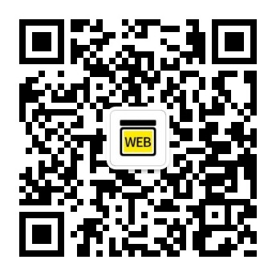

# python基础语法
##### 基于《python编程从入门到实践》整理而成

最初是想给自己整理一份语法字典，发到掘金和微博后发现有人有同样的需求，所以临时整理了pdf版和思维导图。markdown表格因为宽度不允许，所以暂时没有更新，思考好排版后会更新上来。

因为最初只是想自用，所以是根据自己的理解来整理，会有很多不完善的地方，如果有希望补充的地方可以提出来，我会安排时间完善。

**公众号：web前端圈**  

